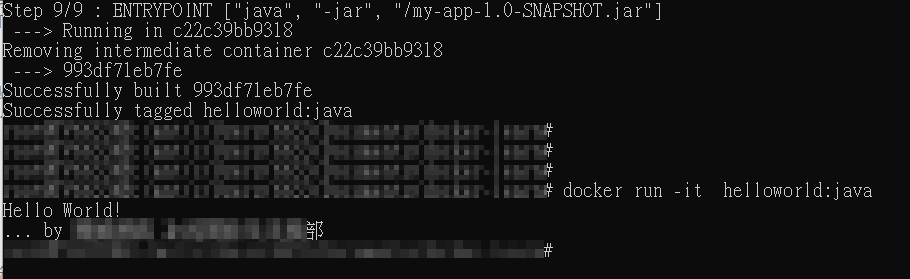
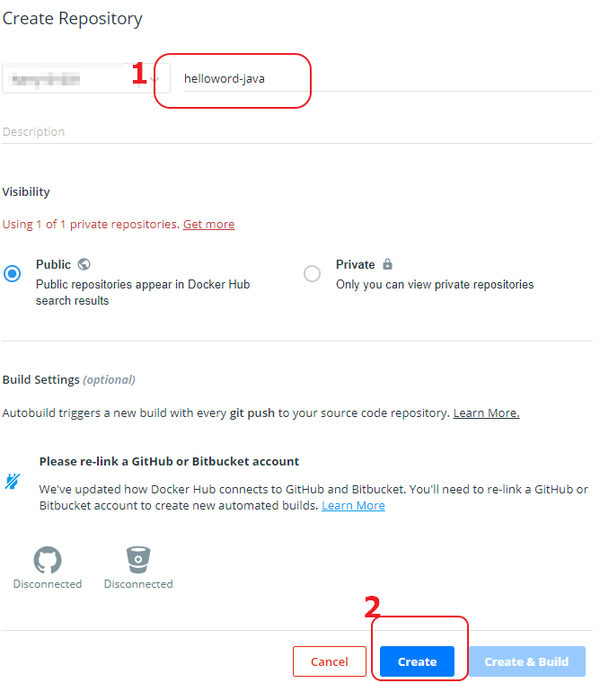

## 此Lab 目標為

+ 了解與測試Dockerfile
+ 將建立的docker image 上傳到公開的docker hub上

### Dockerfile

---

#### Dockerfile-1  主要查看一般dockerfile 基本元件

#### Dockerfile-builder 認識builder 作用與好處

#### Dockerfile-builder-git 建議結合git 來做為source code版本控管


##### 說明:

```
$  git clone https://github.com/harryliu123/docker-learn.git
$  cd docker-learn
$  docker build -t <image_name>:<tag> . --no-cache -f <Dockerfile>
$  docker run -it -d -p <你想要開放的port>:8080 <image_name>:<tag>
$  curl http://127.0.0.1:<你想要開放的port>/ping  會出現  Hello World
```


##### 範例:

```
$  git clone https://github.com/harryliu123/docker-learn.git
$  cd docker-learn
$  docker build -t helloword:v0.1 . --no-cache -f Dockerfile-1
$  docker run -it -d -p 8081:8080 helloword:v0.1
$  curl http://127.0.0.1:8081/ping  會出現  Hello World
```


#### Dockerfile-java

##### 範例:

```
$  git clone https://github.com/harryliu123/docker-learn.git
$  cd docker-learn
$  docker build -t helloword:java . --no-cache -f Dockerfile-java
$  docker run -it  helloword:java

```




### 上傳到Docker hub

---

1. 請到docker 網站上註冊一個帳號  https://hub.docker.com/

2. Create Repository --> 取一個名稱helloword-java --> Create

3. 右上角的帳號地方下拉選單選取 My Profile  -->  點選剛剛建立的 Repositories

4. 看到Repositories 名稱就是您要上傳上去的名稱  ex: <帳號>/helloword-java

5. 接著您可以在docker cmd 位置準備上傳

   

```
## 查看剛剛透過dockerfile 產生的images
$ docker images

	REPOSITORY                   TAG                 IMAGE ID            CREATED             SIZE
	helloworld                   java                993df71eb7fe        3 hours ago         147MB

## 替image下一個tag
$ docker tag helloworld:java  <帳號>/helloword-java
$ docker images

	REPOSITORY                   TAG                 IMAGE ID            CREATED             SIZE
	<帳號>/helloword-java         latest              993df71eb7fe        3 hours ago         147MB
	helloworld                   java                993df71eb7fe        3 hours ago         147MB

## 登入docker hub
$ docker login

	Login with your Docker ID to push and pull images from Docker Hub. If you don't have a Docker ID, head 		over to https://hub.docker.com to create one.
	Username: *****
	Password:
	WARNING! Your password will be stored unencrypted in /root/.docker/config.json.
	Configure a credential helper to remove this warning. See
	https://docs.docker.com/engine/reference/commandline/login/#credentials-store

	Login Succeeded

## 上傳
$ docker push <帳號>/helloword-java

	The push refers to repository [docker.io/harry101031/helloword-java]
	8790a344e219: Pushed
	bd6888799faa: Pushed
	ace0eda3e3be: Pushed
	latest: digest: sha256:041e794a1830abb0a6ba2f7712e09071131b65afb8724d6a5f377387cc64548e size: 951
```

6. docker hub網頁上確認 狀態


7. 分享給別人使用你的環境

   ```
   docker run  <帳號>/helloword-java
   ## docker run  harry101031/helloword-java
   ```

   

